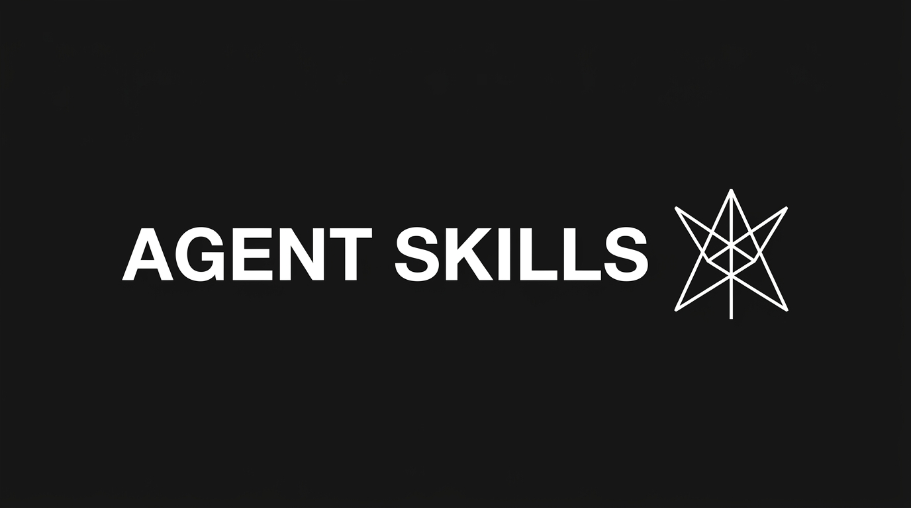
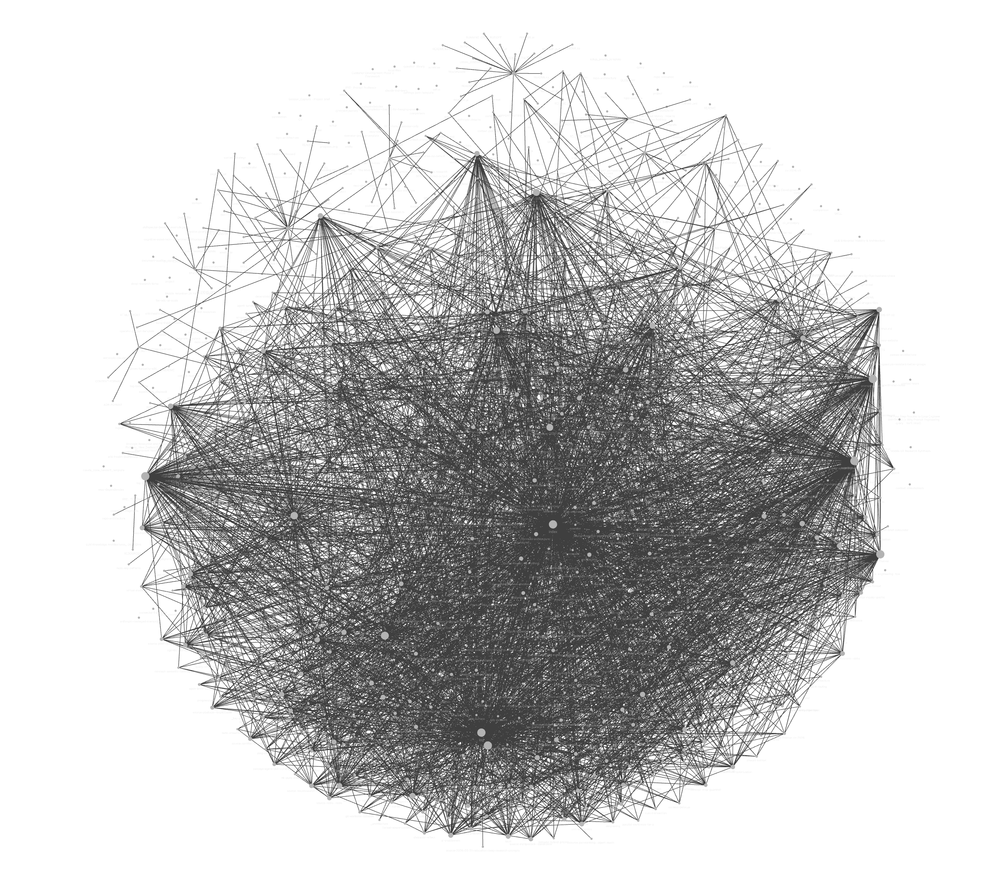

<div align="center">
  

  <h1>Agent Skills</h1>
  <p><b>Disciplined skills for real engineering and automation.</b></p>
</div>

---

## The Philosophy

Most AI agents are dropped into codebases and asked to figure things out on the fly. The result is verbose code, architectural drift, and misaligned expectations.

This repository fixes that. It provides a highly opinionated, zero-slop toolkit of **Agent Skills**. They enforce best practices, establish shared context, and automate complex workflows reliably.

We focus on curing three core Agent Failure Modes:
1. **Misalignment:** The agent builds the wrong thing because it didn't ask questions. *(Solution: `/grill-with-docs`)*
2. **Verbose Code:** The agent invents names instead of using Domain Language. *(Solution: Shared language building)*
3. **Opaque Changes:** The agent makes changes silently, bypassing architectural review. *(Solution: `/improve-codebase-architecture`)*

## 🌟 Featured Skill: Second Brain

<a href="skills/knowledge-management/second-brain/README.md">
  
</a>

> **The ultimate operating system for LLM-managed personal wikis.**

`second-brain` is a comprehensive, multi-branch skill designed to bootstrap, maintain, and autonomously operate an intelligent knowledge vault. It runs deterministic health checks, builds automated navigational indexes, and schedules asynchronous maintenance loops to keep your second brain pristine.

**[Explore the Second Brain skill →](skills/knowledge-management/second-brain/README.md)**

```bash
npx skills@latest add surajgthakkar/agent-skills/second-brain
```

---

## Skills At A Glance

### Knowledge Management
Obsidian-native integrations for personal knowledge graphs.
- **[`obsidian-markdown`](skills/knowledge-management/obsidian-markdown/README.md)** *(via Kepano)*: Native Obsidian Flavored Markdown (Callouts, Wikilinks, Properties).
- **[`obsidian-cli`](skills/knowledge-management/obsidian-cli/README.md)** *(via Kepano)*: Vault interaction via the official Obsidian CLI.
- **[`obsidian-bases`](skills/knowledge-management/obsidian-bases/README.md)** *(via Kepano)*: Database views, filters, formulas, and summaries.
- **[`second-brain`](skills/knowledge-management/second-brain/README.md)** *(by Suraj Thakkar)*: Advanced multi-branch skill for bootstrapping and operating an LLM-managed wiki vault.

### Agent Ops
Meta-skills for teaching, adapting, and expanding agent capabilities.
- **[`skill-creator`](skills/agent-ops/skill-creator/README.md)** *(via Anthropic)*: Benchmark, create, and refine Agent Skills deterministically.

### Productivity
Skills for learning, accelerating workflows, and personal development.
- **[`teach`](skills/productivity/teach/README.md)** *(via Matt Pocock)*: A stateful learning workspace that teaches the user a new concept over multiple sessions.

### Engineering
Architectural alignment and structural engineering disciplines.
- **[`grill-with-docs`](skills/engineering/grill-with-docs/README.md)** *(via Matt Pocock)*: Relentlessly interview the human to achieve complete architectural alignment before touching code.
- **[`improve-codebase-architecture`](skills/engineering/improve-codebase-architecture/README.md)** *(via Matt Pocock)*: Analyze, critique, and holistically restructure codebases.

---

## Installation

These skills are compliant with the standard [Agent Skills specification](https://agentskills.io/specification).

### `npx skills` (Recommended)

Install dynamically into any supported environment via the CLI:

```bash
npx skills@latest add surajgthakkar/agent-skills
```

### Manual Installation

#### Claude Code
Add the contents of this repo to a `/.claude/skills` folder in the root of your project.

#### Codex
Copy the `skills/` directory into your Codex skills path (typically `~/.codex/skills`).

#### Cursor / OpenCode
Clone the repository and add it to your agent's context directory.

---

## Attributions

This repository is a curated collection. With the exception of `second-brain` (created by Suraj Thakkar), all skills are borrowed and adapted from the foundational work of the following creators:
- **[Matt Pocock](https://github.com/mattpocock/skills)**: `grill-with-docs`, `improve-codebase-architecture`, `teach`
- **[Anthropic](https://github.com/anthropics)**: `skill-creator`
- **[Kepano (Stephan Ango)](https://github.com/kepano/obsidian-skills)**: `obsidian-markdown`, `obsidian-cli`, `obsidian-bases`

## License

MIT License. See [LICENSE](./LICENSE).
